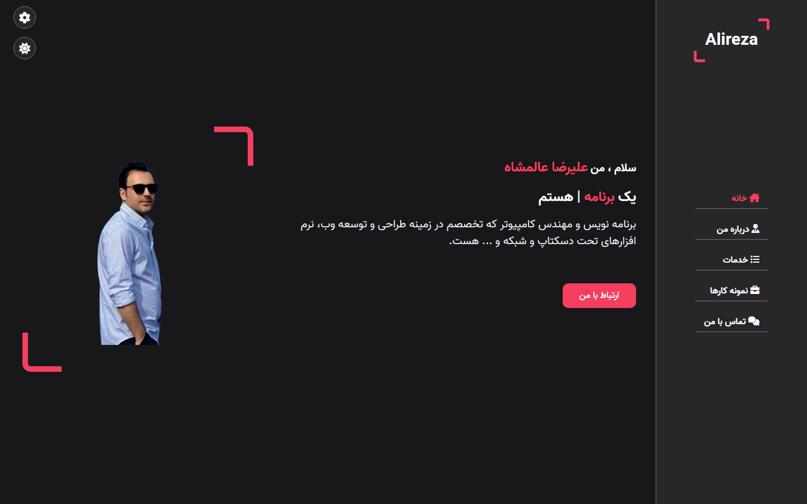

# Alireza Alamshah — Personal Website (Legacy)

A static personal portfolio & tutorials landing page, built with vanilla HTML/CSS/JS.

**[English](#english) | [فارسی](#فارسی)**

> This is an earlier, vanilla-JS version of the personal site. The current version lives in [new-portfolio](https://github.com/alirezaalamshah/new-portfolio).

---

## English

### Screenshot



### About

A single-page personal site (Persian, RTL) with a sidebar nav (خانه/درباره من/خدمات/نمونه کارها/تماس با من), a typing-effect headline ("یک `توسعه دهنده وب` هستم"), and a live color-skin switcher with 6 selectable palettes.

### Tech Stack

- Vanilla HTML, CSS, JavaScript (no build step) — `js/script.js`, `js/style-switcher.js`
- Font Awesome icons, Vazir font (loaded from CDN)
- `css/skins/color-{1..6}.css` — swappable color themes

### Getting Started

No build tools required — just open `index.html` in a browser, or serve the folder statically:

```bash
npx serve .
```

---

## فارسی

### تصویر


### درباره

یک صفحه‌ی شخصی تک‌صفحه‌ای (فارسی، راست‌به‌چپ) با منوی کناری (خانه/درباره من/خدمات/نمونه کارها/تماس با من)، افکت تایپینگ در عنوان («یک `توسعه دهنده وب` هستم») و امکان تغییر زنده‌ی پوسته‌ی رنگی با ۶ پالت قابل‌انتخاب.

### پشته فناوری

- HTML، CSS و جاوااسکریپت خالص (بدون نیاز به build) — `js/script.js`، `js/style-switcher.js`
- آیکون‌های Font Awesome، فونت وزیر (از CDN)
- `css/skins/color-{1..6}.css` — تم‌های رنگی قابل تعویض

### راه‌اندازی

نیازی به ابزار build نیست — کافیست `index.html` را در مرورگر باز کنید، یا پوشه را به‌صورت استاتیک سرو کنید:

```bash
npx serve .
```
